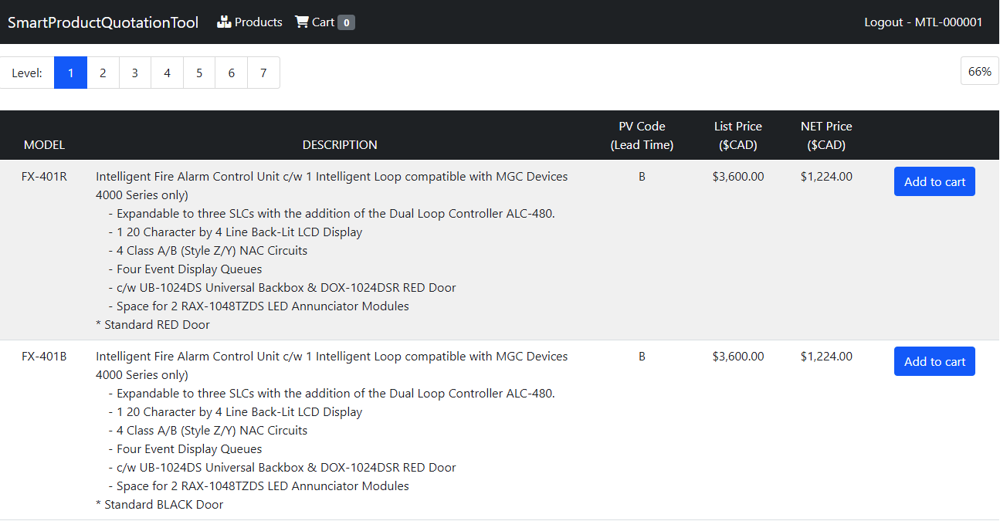
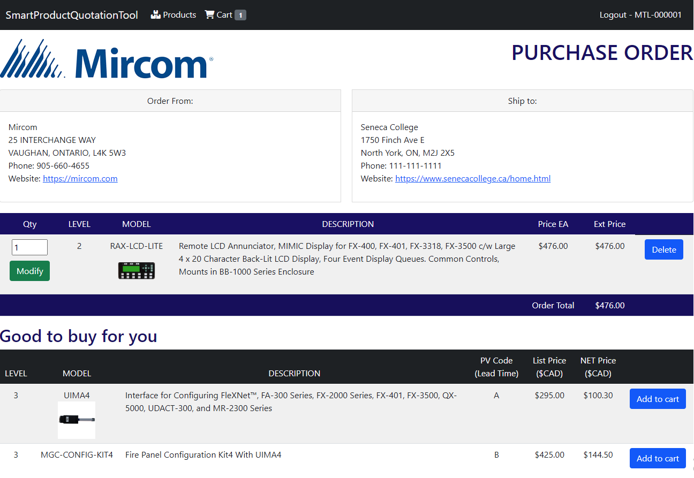
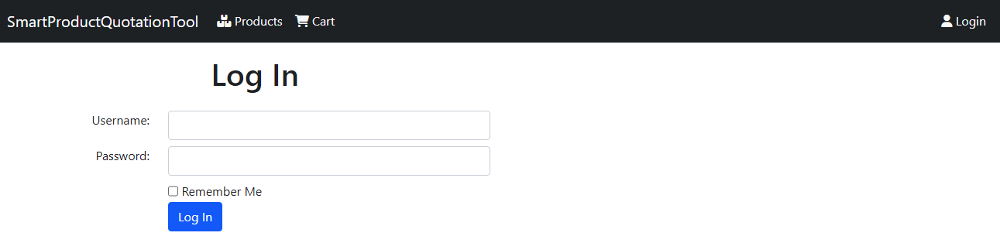
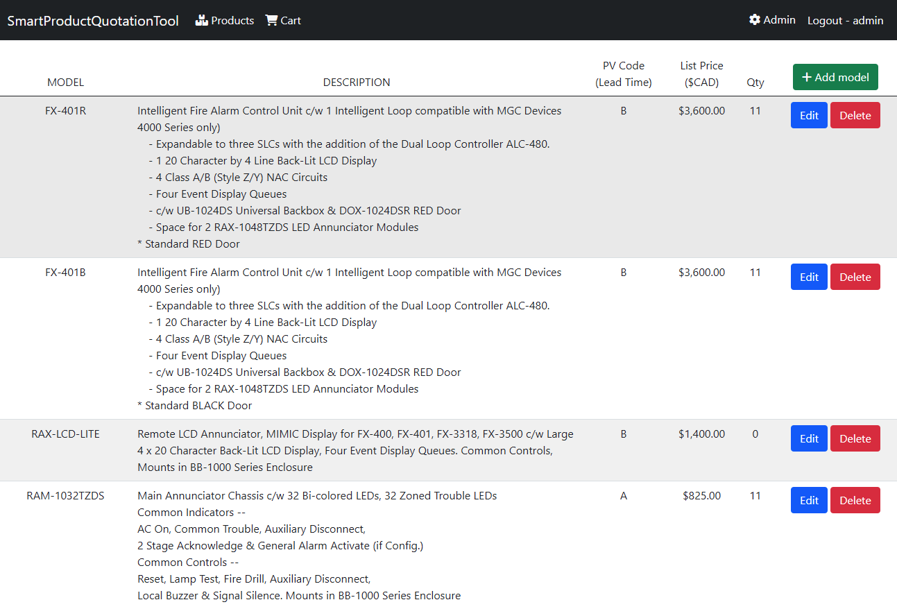
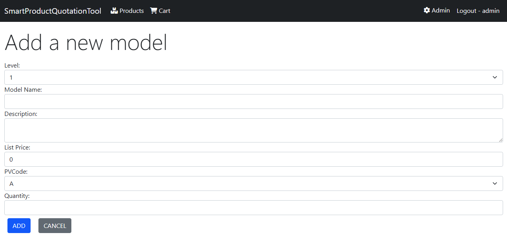
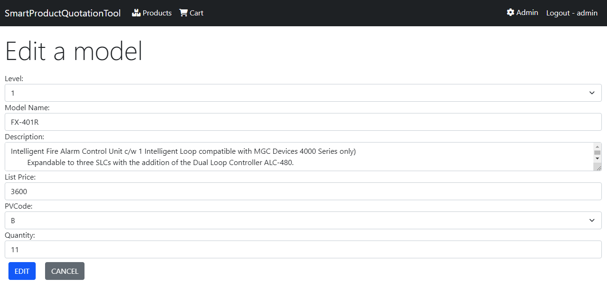

<h1>Smart Product Quote Tool</h1>

This was made for Smart Cities Hackathon by Seneca College.

<ul>
  <li>Build an <strong>ASP.NET core MVC</strong> web app to manage products and users using <strong>C#</strong>, and design using <strong>Bootstrap</strong></li>
  <li>Authenticate and authorize users to add, edit, or delete a project by checking their ID and password</li>
  <li>Migrate the databases of products’, carts’ and users’ information, to <strong>Microsoft SQL Server</strong> to CRUD</li>
  <li>We will try to make the search system with keywords via AI, and add login API with Google and Microsoft</li>
</ul>
<h5>How to run this code?</h5>

You should have visual studio installed C# and .NET
   Tool -> NuGet Package Manager -> NuGet Package Console
   In the <strong>NuGet Package Console</strong>, type 'update-database'
   Now, you can see the saved database in 'View -> SQL Server Object Explorer'

 

  <h4>1. When you login as a User</h4>
  
  
You can see your discount rate, the products listed by level, and how many item you put into your cart
   Every user have their own discount rate. NET price is calculated automatically by the user

  <h4>2. When you add item to cart</h4>
  
  
You can check your address to get the item you selected, total price calculated
     There is a recommendation system. If a user select 1 item in level 2, the system recomment them higher level items

  <h4>3. Login Page</h4>
  
  
You can login as a user or administrator, and save your information

  <h4>4. When you login as an administrator</h4>
  
  
When you login as an admin, you can see there is a manage tab on the header
   You can add, edit, delete models after clicking Manage tab

  <h4>5. Add a model page</h4>
  
  
You can add a product when you make a new model by entering information

  <h4>6. Edit the model page</h4>
  
  
You can edit the information of the product you selected. The information should be shown.

